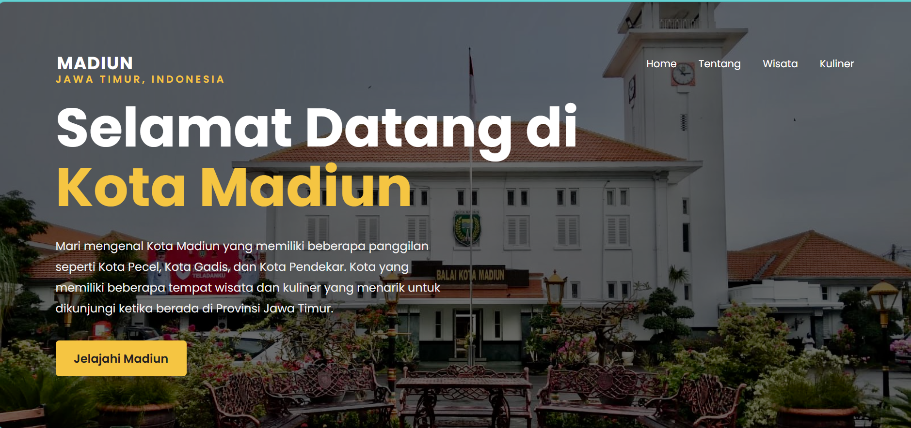
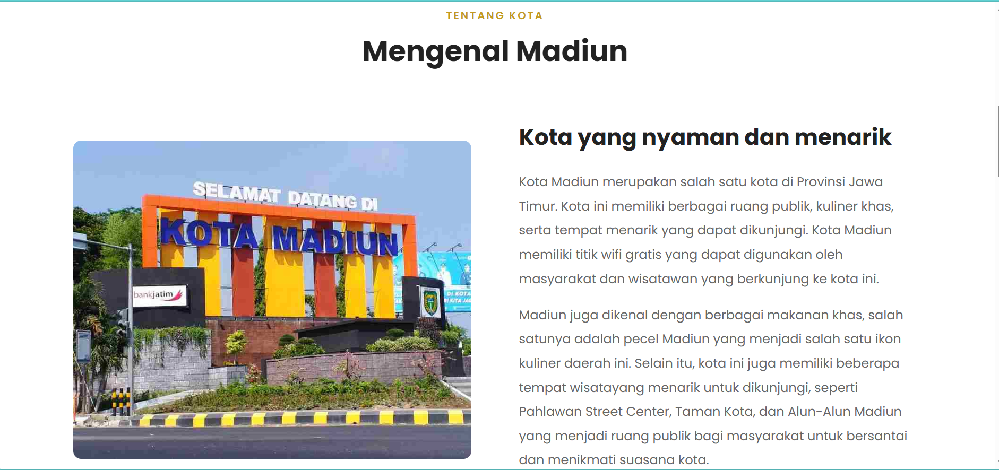
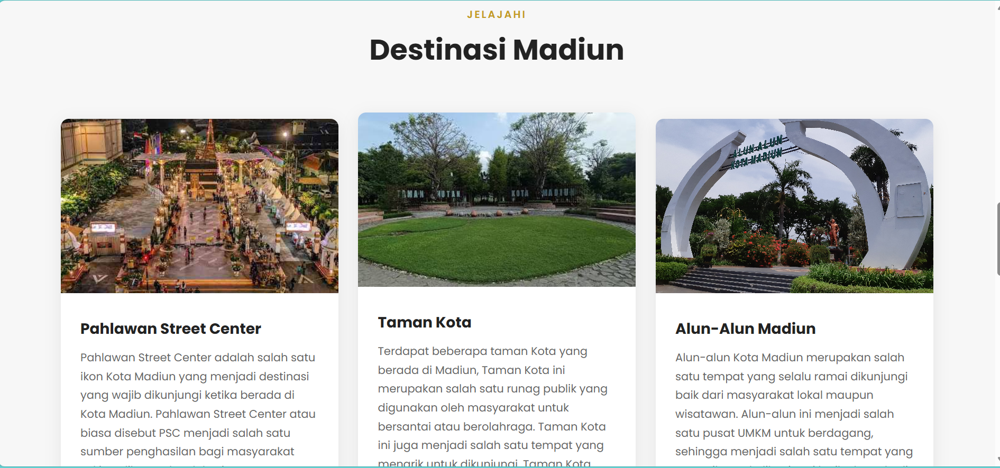
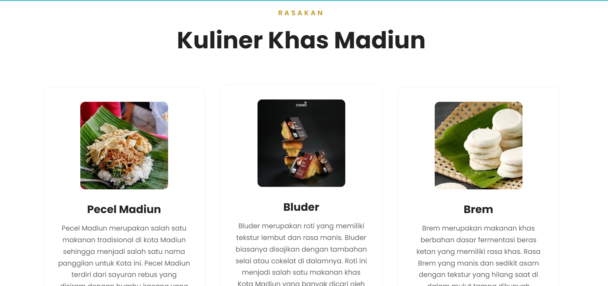

# Profil Kota Madiun

Website profil Kota Madiun yang menyajikan informasi mengenai Kota Madiun dalam bentuk website sederhana dan informatif.

## 📌 Deskripsi

Website ini dibuat sebagai media informasi mengenai Kota Madiun. Website menampilkan beberapa informasi dan visual yang berkaitan dengan Kota Madiun, seperti ikon kota, tempat, kuliner, serta informasi pendukung lainnya.

Website dikembangkan menggunakan HTML dan CSS dengan struktur halaman yang sederhana sehingga dapat dijalankan secara langsung melalui browser.

## 🛠️ Teknologi yang Digunakan

* HTML5
* CSS3
* Visual Studio Code
* Git & GitHub

## 📁 Struktur Project

Profil-Kota-Madiun/
├── README.md
└── profil/
    ├── index.html
    ├── style.css
    └── images/
        ├── alun.jpg
        ├── balai.jpg
        ├── bluder.jpg
        ├── brem.jpg
        ├── kotamadiun.jpg
        ├── pecel.jpg
        ├── psc.jpeg
        └── taman.jpg

▶️ Cara Menjalankan Website

### Cara 1 — Menggunakan Browser

1. Download atau clone repository dari GitHub.
2. Buka folder project.
3. Masuk ke folder `profil`.
4. Buka file `index.html`.
5. Website akan terbuka melalui browser.

### Cara 2 — Menggunakan Visual Studio Code

1. Buka folder `Profil-Kota-Madiun` menggunakan Visual Studio Code.
2. Buka folder `profil`.
3. Buka file `index.html`.
4. Jalankan menggunakan browser atau ekstensi Live Server jika tersedia.
5. Website dapat dilihat secara langsung melalui browser.

## 🖼️ Dokumentasi

Website menggunakan beberapa gambar yang disimpan di dalam folder `profil/images/`.

Gambar tersebut digunakan sebagai bagian dari tampilan dan informasi pada website Profil Kota Madiun.

## 🖼️ Screenshot Website

## 📚 Tujuan Project

Project ini dibuat sebagai website informasi mengenai Kota Madiun sekaligus sebagai dokumentasi project web yang menggunakan HTML dan CSS.

## 👩‍💻 Author

**Natasya Andryana Saputri**

GitHub: [NatasyaAS02](https://github.com/NatasyaAS02)
